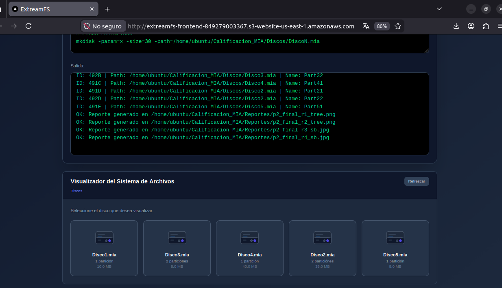
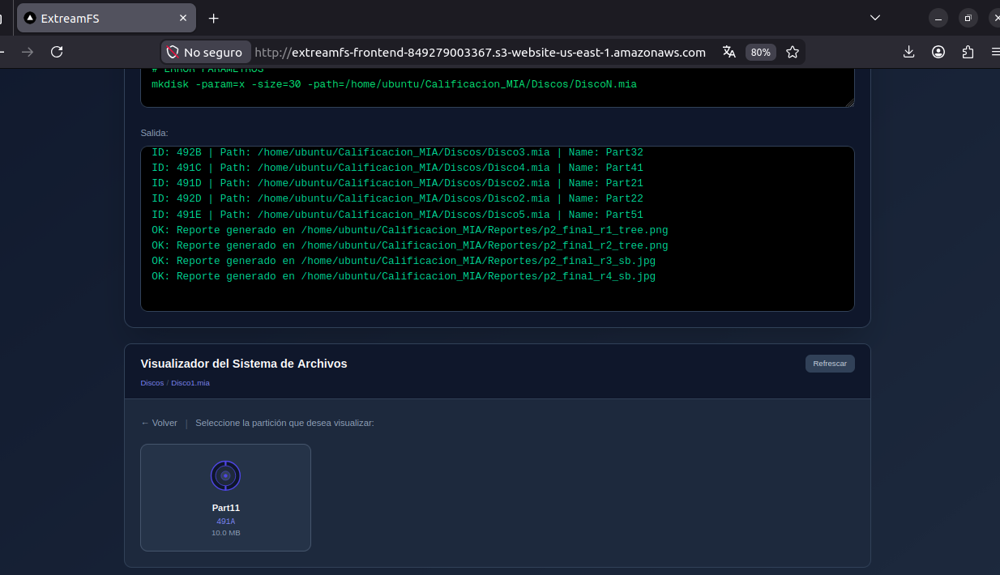
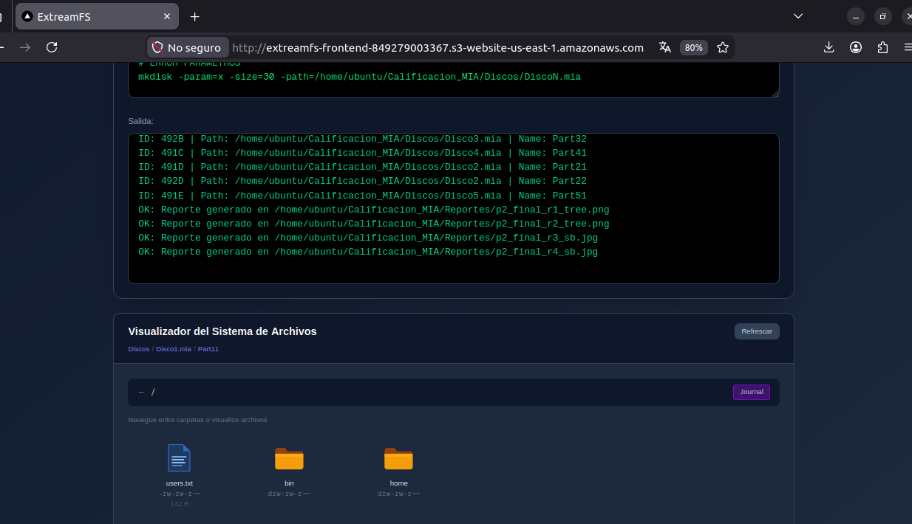
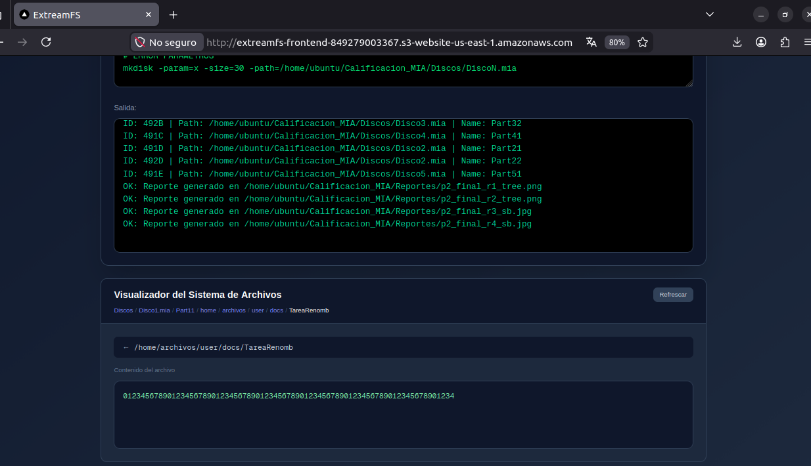

# Manual de Usuario — ExtreamFS

| Nombre | Carnet |
|---|---|
| Mariano Roberto Rac Noguera | 202101149 |

---

## Tabla de Contenidos

1. [Introducción](#introducción)
2. [Acceso al Sistema](#acceso-al-sistema)
3. [Interfaz de Usuario](#interfaz-de-usuario)
4. [Iniciar Sesión](#iniciar-sesión)
5. [Ejecutar Comandos](#ejecutar-comandos)
6. [Explorador de Archivos](#explorador-de-archivos)
7. [Journal EXT3](#journal-ext3)
8. [Comandos de referencia rápida](#comandos-de-referencia-rápida)
9. [Solución de Problemas](#solución-de-problemas)

---

## Introducción

**ExtreamFS** es un simulador de sistemas de archivos EXT2 y EXT3 accesible desde el navegador web. El sistema está desplegado en AWS: el frontend corre en S3 y el backend en EC2.

Con ExtreamFS puedes:
- Crear discos virtuales y particiones
- Formatear particiones como EXT2 o EXT3
- Gestionar usuarios, grupos y permisos POSIX
- Crear, copiar, mover, renombrar y eliminar archivos y carpetas
- Buscar archivos por nombre y patrón
- Ver el journal de operaciones en particiones EXT3
- Generar reportes gráficos de la estructura interna del filesystem

---

## Acceso al Sistema

### URLs

| Qué | URL |
|---|---|
| **Frontend (interfaz web)** | http://extreamfs-frontend-849279003367.s3-website-us-east-1.amazonaws.com |
| **Backend (API)** | http://13.218.255.179:8080 |
| **Verificar backend** | http://13.218.255.179:8080/status → responde `{"status":"ok"}` |

No se requiere instalación. Solo abrir el link del frontend en cualquier navegador moderno.

---

## Interfaz de Usuario

La pantalla principal tiene tres zonas:

```
┌────────────────────────────────────────────────────────┐
│  ExtreamFS            [Sin sesión activa] [Iniciar Sesión] │
├──────────────────────────┬─────────────────────────────┤
│                          │                             │
│   TERMINAL               │   EXPLORADOR DE ARCHIVOS    │
│   ─────────              │   ──────────────────────    │
│   Entrada:               │   [Refrescar]               │
│   ┌──────────────────┐   │   Disco1.mia                │
│   │                  │   │     └─ Part11 (491A)         │
│   └──────────────────┘   │         └─ /home/           │
│   [Examinar] [Ejecutar]  │             └─ archivo.txt  │
│                          │                             │
│   Salida:                │   [Panel de contenido]      │
│   ┌──────────────────┐   │   (muestra el archivo       │
│   │ # resultados     │   │    o el journal al hacer    │
│   │ OK: ...          │   │    clic)                    │
│   └──────────────────┘   │                             │
└──────────────────────────┴─────────────────────────────┘
```

### Componentes

| Componente | Función |
|---|---|
| **Barra superior** | Muestra usuario, grupo y partición activos; botón de sesión |
| **Terminal — Entrada** | Escribe comandos o carga un archivo `.smia` |
| **Terminal — Salida** | Muestra el resultado de cada comando (verde=OK, rojo=ERROR) |
| **Botón Examinar** | Carga un archivo `.smia` para ejecutar como script |
| **Botón Ejecutar** | Ejecuta el comando o script cargado |
| **Explorador** | Navega discos → particiones → carpetas → archivos |
| **Panel de contenido** | Muestra el contenido de un archivo al hacer clic en él |



---

## Iniciar Sesión

### Opción A — Botón de la interfaz (recomendado)

1. Clic en **"Iniciar Sesión"** (esquina superior derecha)
2. Llenar el formulario:
   - **ID Partición:** `491A` (partición formateada con EXT2/EXT3)
   - **Usuario:** `root`
   - **Contraseña:** `123`
3. Clic en **Submit**
4. La barra superior cambia a: `root | Grupo: root | Partición: 491A`

### Opción B — Comando en el terminal

```
login -user=root -pass=123 -id=491A
```

### Cerrar sesión

Clic en **"Cerrar Sesión"** en la barra superior, o en el terminal:
```
logout
```

---

## Ejecutar Comandos

### Comando individual

Escribir el comando en el área de **Entrada** y presionar **Ejecutar** o `Enter`:
```
mkdir -p -path=/home/mis_archivos
```

### Script completo

1. Clic en **"Examinar"** → seleccionar el archivo `Archivo_De_Prueba_P2.smia`
2. El script aparece en el área de Entrada
3. Clic en **"Ejecutar Script"** → se ejecutan los ~221 comandos en secuencia
4. Mientras corre, el botón muestra **"Ejecutando script..."**

> Las líneas que empiezan con `#` son comentarios y se ignoran.

---

## Explorador de Archivos

### Navegar el sistema de archivos

1. Clic en **"Refrescar"** para cargar los discos montados
2. Clic en un disco (ej. `Disco1.mia`) → aparecen sus particiones
3. Clic en una partición (ej. `Part11 (491A)`) → abre el directorio raíz `/`
4. Clic en una carpeta → entra en ella (el breadcrumb muestra la ruta)
5. Clic en un archivo → el panel derecho muestra su contenido







### Información que muestra el explorador

Para cada archivo o carpeta se muestran:
- Nombre
- Tipo (carpeta o archivo)
- Permisos (ej. `rwxr-xr-x`)
- Propietario (ej. `user1`)
- Tamaño (para archivos)

### Particiones disponibles después del script de prueba

| ID | Disco | Partición | Tipo |
|---|---|---|---|
| 491A | Disco1.mia | Part11 | EXT2 |
| 491B | Disco3.mia | Part31 | EXT3 |
| 492B | Disco3.mia | Part32 | EXT3 |
| 491C | Disco4.mia | Part41 | EXT3 |
| 491D | Disco2.mia | Part21 | EXT2 |
| 492D | Disco2.mia | Part22 | EXT2 |
| 491E | Disco5.mia | Part51 | EXT3 |

---

## Journal EXT3

Las particiones formateadas con EXT3 registran cada operación en un journal.

### Ver el journal desde la interfaz

1. Navegar a una partición EXT3 (ej. `491B`)
2. Entrar a cualquier carpeta
3. Aparece el botón **"Journal"** en la barra de navegación
4. Clic en **Journal** → el panel derecho muestra la lista de operaciones:

```
[1] mkdir   /home/user1/documentos      2026-04-21 10:05:33
[2] mkfile  /home/user1/documentos/nota.txt  2026-04-21 10:05:34
[3] rename  /home/user1/documentos/nota.txt  → nota_v2.txt
[4] copy    /home/user1/documentos/readme.md → /proyectos/mia
[5] move    /home/user1/documentos/nota_v2.txt → /proyectos
[6] remove  /home/user1/proyectos/mia/readme.md
[7] chmod   /home/user1/proyectos/mia/main.cpp  → 700
[8] chown   /home/user1/proyectos               → user1
```

### Ver el journal por comando

```
journaling -id=491B
```

### Simular pérdida de datos

```
loss -id=491B
```

Esto borra el journal (simula corrupción). Después del `loss`, `journaling` muestra vacío.

---

## Comandos de referencia rápida

### Flujo básico completo

```bash
# 1. Crear disco y partición
mkdisk -size=50 -unit=M -fit=FF -path=/home/ubuntu/Calificacion_MIA/Discos/Disco1.mia
fdisk -type=P -unit=M -name=Part11 -size=20 -path=/home/ubuntu/Calificacion_MIA/Discos/Disco1.mia

# 2. Montar y formatear
mount -path=/home/ubuntu/Calificacion_MIA/Discos/Disco1.mia -name=Part11
mkfs -type=full -id=491A -fs=2fs

# 3. Login y operaciones
login -user=root -pass=123 -id=491A
mkdir -p -path=/home/mis_docs
mkfile -path=/home/mis_docs/nota.txt -size=100
cat -file1=/home/mis_docs/nota.txt

# 4. Permisos
chmod -path=/home/mis_docs/nota.txt -ugo=644
chown -path=/home/mis_docs/nota.txt -usuario=user1

# 5. Reporte y logout
rep -id=491A -path=/home/ubuntu/Calificacion_MIA/Reportes/tree.png -name=tree
logout
```

### Comandos nuevos P2

```bash
# FDISK — eliminar y ampliar
fdisk -delete=fast -name=Part11 -path=Disco1.mia     # eliminar (rápido)
fdisk -delete=full -name=Part11 -path=Disco1.mia     # eliminar (completo)
fdisk -add=5 -unit=M -name=Part11 -path=Disco1.mia   # ampliar +5MB
fdisk -add=-2 -unit=M -name=Part11 -path=Disco1.mia  # reducir -2MB

# UNMOUNT
unmount -id=491A

# EXT3
mkfs -type=full -id=491B -fs=3fs
journaling -id=491B
loss -id=491B

# Archivo y directorio
rename -path=/home/archivo.txt -name=nuevo.txt
copy   -path=/home/archivo.txt -destino=/home/backup
move   -path=/home/archivo.txt -destino=/home/docs
remove -path=/home/archivo.txt

# Búsqueda (soporta * y ?)
find -path=/home -name=*.txt
find -path=/ -name=Tarea?.txt

# CAT con múltiples archivos
cat -file1=/home/a.txt -file2=/home/b.txt -file3=/home/c.txt
```

---

## Ver reportes generados

Los reportes se generan en el EC2 y se pueden ver directamente desde el navegador:

```
http://13.218.255.179:8080/report?path=/home/ubuntu/Calificacion_MIA/Reportes/NOMBRE_REPORTE.png
```

Ejemplos:
- [Árbol EXT2 final](http://13.218.255.179:8080/report?path=/home/ubuntu/Calificacion_MIA/Reportes/p2_final_r1_tree.png)
- [Árbol EXT3 final](http://13.218.255.179:8080/report?path=/home/ubuntu/Calificacion_MIA/Reportes/p2_final_r2_tree.png)
- [LS con permisos](http://13.218.255.179:8080/report?path=/home/ubuntu/Calificacion_MIA/Reportes/p2_r4_ls_chmod.jpg)
- [LS con propietario](http://13.218.255.179:8080/report?path=/home/ubuntu/Calificacion_MIA/Reportes/p2_r5_ls_chown.jpg)

---

## Solución de Problemas

| Problema | Causa probable | Solución |
|---|---|---|
| "No se pudo conectar al backend" | EC2 apagado o IP cambió | Verificar `http://13.218.255.179:8080/status` |
| "No hay sesión activa" | Olvidó hacer login | `login -user=root -pass=123 -id=491A` |
| "ID no montado" | Partición no montada | `mount -path=... -name=...` primero |
| "El disco no existe" | Archivo .mia no creado | Ejecutar `mkdisk` primero |
| "Límite de 4 particiones" | MBR lleno | Máximo 4 particiones por disco |
| El explorador no muestra archivos | Partición no tiene mkfs | `mkfs -type=full -id=ID -fs=2fs` |
| El journal aparece vacío | Se ejecutó `loss` | Normal después de simular pérdida |
| Script corre muy lento | Latencia de red al EC2 | Normal — 221 comandos × red = ~3–5 min |
